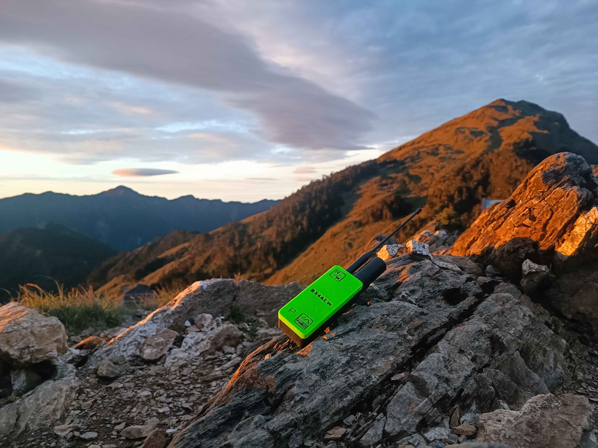

# MeshHam - Meshtastic 手持節點

[🇺🇸 / 🇬🇧 Click here for English version](readme.md)

歡迎來到 **MeshHam** Meshtastic 手持節點的開源庫。本專案提供了自行組裝 MeshHam 所需的所有開源資源，包含物料清單 (BoM)、3D 列印外殼的 STL 檔案以及相關說明文件。

## 📌 開源發布策略 (N-1 原則)
請注意，本開源庫採用 **N-1 版本發布策略**。
這裡僅會開放上一代及更早版本的設計檔案。舉例來說，當最新的 **V4.0** 推出時，本庫才會解鎖並上傳 **V3.0**（及更早版本）的完整開源資料。最新版本的設計將暫時保留不在此處公開。

## 📂 目錄結構
* `/STL` - 手持節點外殼的 3D 列印模型檔案。
* `/BoM` - 物料清單，包含所需的硬體、螺絲及電子零件詳細規格。
* `/Docs` - 組裝說明與其他補充文件。

## ⚖️ 授權條款
本專案採用 **創用 CC 姓名標示-非商業性 4.0 國際 (CC BY-NC 4.0)** 授權。

* **個人用戶 / 創客玩家：** 您可以自由下載、3D 列印並修改這些檔案供個人使用。如果您分享了修改後的版本，**必須明確註明原作者與出處**（附上本 GitHub 連結）。
* **公司 / 商業用途：** 嚴禁任何公司或個人將本庫的檔案、設計或衍生實體產品用於**任何商業營利目的**（例如量產販售外殼、販售組裝好的成品機等）。

## 👤 作者
Designed by **理查 （BU4BC）**.

